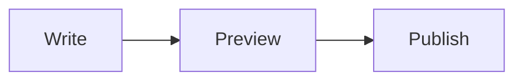
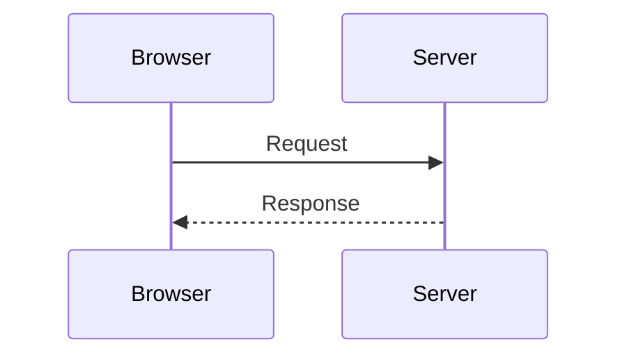

This page showcases the formatting syntax supported by fridge.dev's renderer. This syntax is used and supported in journal posts and the mdpaste tool.

To view the raw syntax, press the !fa solid code button.
# Headings

## Level two

### Level three

#### Level four

##### Level five

###### Level six

Alternative level one
=====================

Alternative level two
---------------------

### Heading with a custom ID {#custom-heading}

[Jump to the custom heading](#custom-heading)

## Paragraphs and line breaks

A blank line starts a new paragraph.

Two trailing spaces create a hard break.  
This text begins on the next line.

## Inline formatting

*Italic* or _italic with underscores_.

**Bold** or __bold with underscores__.

***Bold italic*** or ___bold italic with underscores___.

~~Strikethrough~~ and ==highlighted text==.

Escaped punctuation stays literal: \*not italic\*, \#not a heading, and \[not a link\].

Inline HTML adds <u>underline</u>, <ins>inserted text</ins>, H<sub>2</sub>O, x<sup>2</sup>, <small>small text</small>, <kbd>Ctrl</kbd> + <kbd>C</kbd>, <samp>success</samp>, and <var>filename</var>.

HTML entities render normally: &copy;, &amp;, and &nbsp;.

## Blockquotes

> A blockquote can contain **formatting**, `code`, and multiple paragraphs.
>
> This is its second paragraph.
>
>> Nested blockquote.

## GitHub alerts

> [!NOTE]
> Useful context.

> [!TIP]
> A practical suggestion.

> [!IMPORTANT]
> Essential information.

> [!WARNING]
> Something needs attention.

> [!CAUTION]
> A possible negative outcome.

## Lists

- Unordered item
    - Nested unordered item
    1. Nested ordered item
- Another item

3. Ordered list starting at three
4. Another ordered item
    1. Nested ordered item

- [x] Completed task
- [ ] Incomplete task
    - [ ] Nested task

## Horizontal rule

---

## Links

[External link](https://example.com "Optional title") and [internal link](/formatting).

<example.com>, <person@example.com>, and mailto:person@example.com are automatically linked.

A bare URL is linked too: https://example.com/docs.

[Reference-style link][reference] and [short reference].

[[Internal Page]] and [[Internal Page|custom label]] use wiki-link styling.

[reference]: https://example.com/reference "Reference title"
[short reference]: https://example.com/short

## Images


[](https://example.com)

![Reference image][reference-image]

{width=50%}

![[/resources/favicon.svg]]

[reference-image]: https://picsum.photos/400/202 "Reference image"

## Code

Use `inline code` without changing the surrounding font. Double delimiters allow a backtick: ``Use `code` here.``

```javascript title="example.js" {2-3}
const greeting = "hello";
console.log(greeting);
```

    Indented code remains inside its code block.
    Its source indentation is preserved internally.

## Tables

| Left | Centre | Right |
| :--- | :----: | ----: |
| Plain | **Bold** | `code` |
| Escaped pipe | `a \| b` | [Link](/formatting) |

## Collapsible content

<details>
<summary>Open the details</summary>

The body supports **Markdown**, lists, and `code`.

- Nested content
- Another item

</details>

<details open>
<summary>Initially open</summary>

This section begins expanded.

</details>

## Footnotes

This statement has a footnote.[^source] Repeated references return to each occurrence.[^source]

[^source]: Footnotes support **formatting**, links, and multiple paragraphs.

    This is the second footnote paragraph.

## Abbreviations

HTML and CSS gain site tooltips from abbreviation definitions.

*[HTML]: HyperText Markup Language
*[CSS]: Cascading Style Sheets

An explicit <abbr title="Application Programming Interface">API</abbr> works too.

## Mathematics

Inline mathematics: $E = mc^2$.

$$
\frac{-b \pm \sqrt{b^2 - 4ac}}{2a}
$$

## Diagrams





## Emoji and citations

Supported shortcodes include :rocket:, :sparkles:, :warning:, and :shipit:.

Pandoc-style citations render as [@reference] or grouped citations [@first; -@second].

## Font Awesome icons

Use `!fa`, an icon style, and an icon name: !fa solid code

Regular and brand icons work too: !fa regular heart and !fa brands github.

[Browse all available free icons](https://fontawesome.com/search?ic=free-collection).

Use `!frdg` to display the fridge.dev site icon inline: !frdg

## Safe HTML

<div id="styled-block" style="color: #79b98b; background-color: #101010; text-align: center; max-width: 100%">

Markdown remains active inside a safe styled block.

</div>

<ruby>
漢<rp>(</rp><rt>kan</rt><rp>)</rp>
</ruby>

<span lang="ar" dir="rtl">مرحبا بالعالم</span>

HTML comments are removed from output. <!-- hidden comment -->

## Audio and video

<audio src="https://interactive-examples.mdn.mozilla.net/media/cc0-audio/t-rex-roar.mp3"></audio>

<video src="https://interactive-examples.mdn.mozilla.net/media/cc0-videos/flower.webm"></video>
