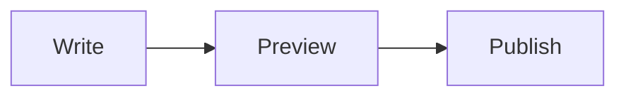
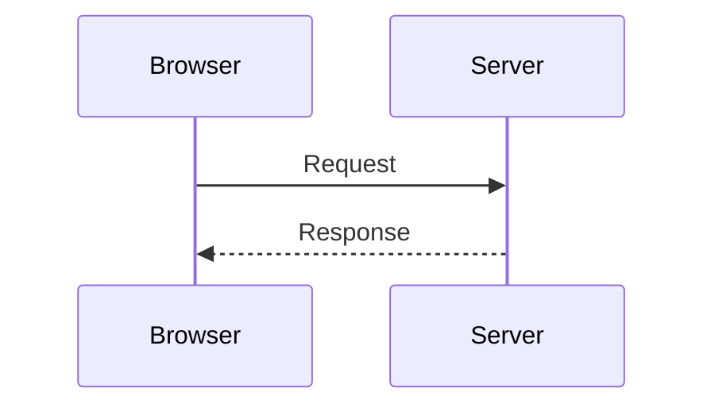

# Journal Markdown test

This paragraph tests ordinary text, a hard line break,  
and the following line.

## Inline formatting

*Italic*, **bold**, ***bold italic***, ~~strikethrough~~, ==highlighted text==, and <u>underlined text</u>.

Chemical and mathematical text: H<sub>2</sub>O and x<sup>2</sup>. Press <kbd>Ctrl</kbd> + <kbd>C</kbd>; output can use <samp>success</samp> and <var>filename</var>.

Inline code keeps Markdown literal: `**not bold**`, and double backticks can contain one backtick: ``Use `code` here.``

Escaped formatting remains literal: \*not italic\*, \#not a heading, and \[not a link\].

## Font Awesome

Solid: !fa solid code

Regular: !fa regular heart

Brand: !fa brands github

## Links and images

[External link](https://example.com "Example") and [internal link](/journal).

<example.com>, <person@example.com>, mailto:person@example.com, and https://example.com/bare-url.

[Reference link][reference] and [[Internal Page|wiki-style label]].


[](https://fridge.dev)

{width=50%}

[reference]: https://example.com/reference "Reference title"

## Blockquotes and alerts

> A blockquote with **bold text** and `inline code`.
>
>> A nested blockquote.

> [!NOTE]
> This is a note alert.

> [!TIP]
> This is a tip alert.

> [!IMPORTANT]
> This is important.

> [!WARNING]
> This is a warning.

> [!CAUTION]
> This is a caution.

## Lists and tasks

- Unordered item
    - Nested unordered item
    1. Nested ordered item
- Another unordered item

3. Ordered list beginning at three
4. Another ordered item
    1. Nested ordered item

- [x] Completed task
- [ ] Incomplete task
    - [ ] Nested task

## Horizontal rule

---

## Code blocks

```javascript title="example.js" {2-3}
const greeting = "hello";
console.log(greeting);
```

    This is an indented code block.
    Its indentation stays inside the block.

## Table

| Left | Centre | Right |
| :--- | :----: | ----: |
| Plain | **Bold** | `code` |
| Escaped pipe | `a \| b` | [Internal](/formatting) |

## Collapsible content

<details>
<summary>Open this section</summary>

The body contains **Markdown**.

- Nested list item
- Another item

</details>

<details open>
<summary>Initially open</summary>

This section begins expanded.

</details>

## Footnotes and abbreviations

This statement has a footnote.[^test] The same note can be referenced again.[^test]

HTML and CSS use abbreviation tooltips.

*[HTML]: HyperText Markup Language
*[CSS]: Cascading Style Sheets

[^test]: A footnote with **formatting** and an [internal link](/journal).

    This is its second paragraph.

## Mathematics

Inline mathematics: $E = mc^2$.

$$
\frac{-b \pm \sqrt{b^2 - 4ac}}{2a}
$$

## Mermaid diagrams





## Safe HTML

<div id="styled-test" style="color: #79b98b; background-color: #101010; text-align: center; max-width: 100%">

Markdown remains **active** inside this safe block.

</div>

<ruby>漢<rp>(</rp><rt>kan</rt><rp>)</rp></ruby>

<span lang="ar" dir="rtl">مرحبا بالعالم</span>

HTML comments should disappear. <!-- hidden test comment -->

## Emoji and citations

:rocket: :sparkles: :warning: :shipit:

Citation test: [@reference] and [@first; -@second].

## Audio and video

Use the journal toolbar to attach one audio file, one video file, one image, and one recorded voice note beneath this paragraph. Confirm that each temporary placeholder is replaced after publishing.

<audio src="https://interactive-examples.mdn.mozilla.net/media/cc0-audio/t-rex-roar.mp3"></audio>

<video src="https://interactive-examples.mdn.mozilla.net/media/cc0-videos/flower.webm"></video>
